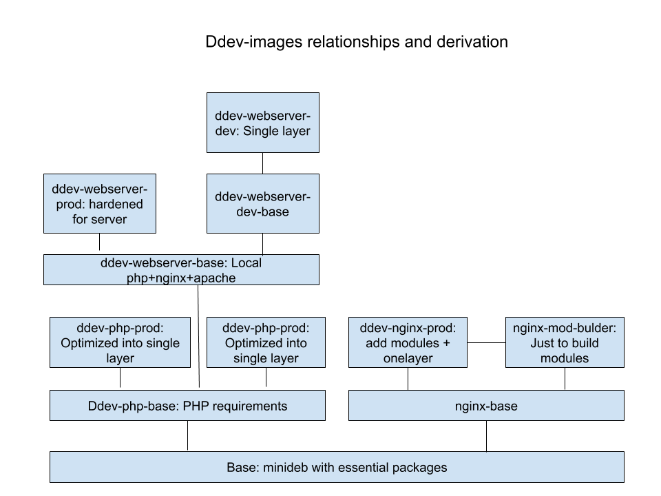

# ddev-images

This repository provides the build techniques for the webserving/php DDEV-Live Docker images and provides the base for DDEV-Local to build ddev-webserver images:

* *ddev-php-prod* is the PHP image used by DDEV-Live. It was formerly embedded in (private) [drud/site-operator/pkg/controller/phpdistro/docker.go](https://github.com/drud/site-operator/blob/master/pkg/controller/phpdistro/docker.go), included [here](obsolete/php-dockerfile.txt) for comparison.
* *ddev-php-base* is the base for ddev-php-prod, and will be used by DDEV-Local to build ddev-webserver images.

## Building

To build, use `make VERSION=<versiontag>` or `make images`. To push, use `make push`

Individual images can be built using `make ddev-php-prod VERSION=<versiontag>`

## Testing

Each image is intended to have a robust set of tests. The tests should be included in the `tests/<imagename>` directory, and should be launched with a `test.sh` in that directory. 

## Image Size comparisons (uncompressed)

| Image           | Old size | New size | Notes                                           |
|-----------------|----------|----------|-------------------------------------------------|
| DDEV-Live PHP (ddev-live-php-prod)  | 752MB    | 725MB    | New has all 6 versions of PHP and still smaller |
| DDEV-LIVE PHP with just php7.3 | 752MB | 594MB |

## Discussion Items

1. **DDEV-Live development/testing**: We have to figure out how I can experiment with and move the DDEV-Live images along. That will mean being able to use and test them in context in DDEV-Live.
2. **Multi-PHP-Version**: The ddev-php-prod image for DDEV-Live currently contains PHP 5.6-7.4, but only one of these runs at a time, determined by an environment variable at startup. Obviously we can have multiple images, each with only one PHP version. Having a multi-php image means managing (and caching) less images. The multi-php ddev-live-php-prod is 27MB smaller than current prod, although a a single-php equivalent would be only 594MB, about 150MB smaller than current prod. 
3. **Building, pulling, and pushing, and repository**: Currently the DDEV-Live Dockerfiles are embedded in a golang file, which doesn't seem very effective for sharing. With this repo, that's somewhwat solved, but we have to figure out about what repository we use, how it gets pushed there, etc.
4. **Details**: 
    * Review the actual PHP extensions bundled. php-ldap, for example, and php-xdebug.
